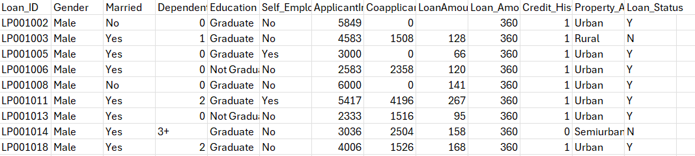
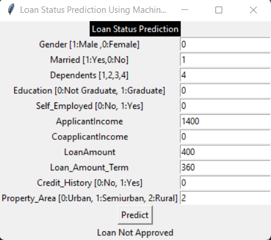

# Loan_Prediction_Model

## Description
This model predicts the loan status whether it is "Approved" or "Not Approved" depending on relevant details of the applicant through machine learning models. In addition, a user-friendly GUI is featured to predict the status of a given loan application.

## Table of Contents
- [Installation](#installation)
- [Usage](#usage)
- [Features](#features)
- [Dataset](#dataset)
- [Models Used](#models-used)
- [Results](#results)
- [Contributing](#contributing)
- [License](#license)

## Installation

### Prerequisites
- Python 3.x


### Steps
1. Download the repository as a zip file from this [link](https://github.com/ruru-lyy/Loan_Prediction_Model/archive/refs/heads/main.zip).

2. Extract the downloaded zip file to a directory of your choice.

3. Open a terminal or command prompt and change directory to the extracted folder (Loan_Prediction_Model).

4. Install dependencies:
   ```bash
    pip install -r requirements.txt
    ```

## Usage

### Running the Model
To run the model, execute:
```bash
python main.py
```

## Running the GUI
To launch the GUI for making predictions, execute -

```bash
python gui.py
```

## Features

- Predict loan status using multiple machine learning models.
- User-friendly GUI for inputting applicant details and displaying prediction results.
- Model performance evaluation and comparison.

## Dataset



This dataset is taken from Kaggle and contains the following details about bank loan applicants-

1. Loan_ID: A unique identifier for each loan application.

2. Gender: The gender of the applicant. Typically, values are 'Male' or 'Female'.

3. Married: Indicates the marital status of the applicant. Values are 'Yes' or 'No'.

4. Dependents: The number of dependents the applicant has. This can be a numeric value, including '0', '1', '2', '3+' (which might be represented as '4' in some cases after processing).

5. Education: Indicates the education level of the applicant. Values are 'Graduate' or 'Not Graduate'.

6. Self_Employed: Indicates whether the applicant is self-employed. Values are 'Yes' or 'No'.

7. ApplicantIncome: The income of the applicant.

8. CoapplicantIncome: The income of the co-applicant, if any. This value can be '0' if there is no co-applicant.

9. LoanAmount: The amount of loan requested by the applicant. Typically, this is in thousands of currency units.

10. Loan_Amount_Term: The term of the loan in months. For example, '360' indicates a loan term of 360 months (30 years).

11. Credit_History: A binary indicator of the applicant's credit history. A value of '1' means the applicant has a good credit history, while '0' indicates a bad credit history.

12. Property_Area: The area where the property is located. This can be 'Urban', 'Semiurban', or 'Rural'.

13. Loan_Status: The status of the loan application. 'Y' means the loan was approved, and 'N' means it was not approved.


## Models Used

- Logistic Regression
- Support Vector Machine (SVM)
- Decision Tree Classifier
- Random Forest Classifier
- Gradient Boosting Classifier
  
## Results
The Random Forest Classifier and the Support Vector Machine achieved the best performance with an accuracy of 80.66% after hyperparameter tuning.

### Performance Before and After Hyperparameter Tuning

1. Logistic Regression
- Before Tuning: 79.3%
- After Tuning: 80.29%
2. Support Vector Machine (SVM)
- Before Tuning: 80.18%
- After Tuning: 80.66%
3. Random Forest Classifier
- Before Tuning: 77.47%
- After Tuning: 80.66%

### GUI

A simple GUI is provided to input the loan application details and get the prediction.

  
## Contributing
Contributions are welcome! Please fork the repository and create a pull request with a clear description of your changes.

## License
This project is licensed under the MIT License. See the LICENSE file for more details.

[MIT](https://choosealicense.com/licenses/mit/)

